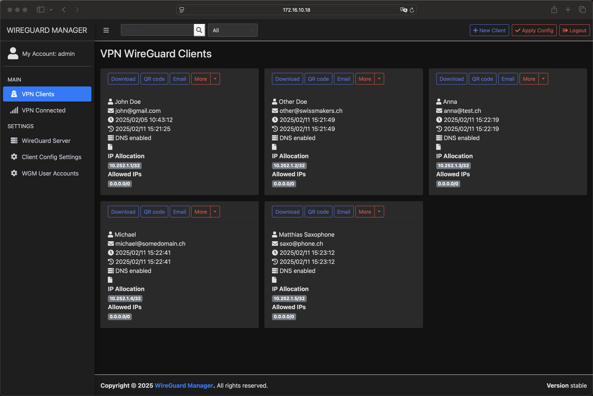

# wireguard-manager

WireGuard Manager is an open-source web application written in Go that simplifies the management of a WireGuard VPN server. It provides a user-friendly web interface for administering server settings, managing VPN client configurations, and handling user accounts. Additionally, the project supports email notifications (via SMTP or SendGrid), secure session management, and configuration change detection.

## Features

- Manage WireGuard server settings, VPN client configurations, and user accounts through an intuitive web interface.
- Create, update, and delete VPN clients. Automatically generate client configurations and QR codes.
- Send client configuration files via email using either SMTP or SendGrid.
- Secure Session Management: Sessions are managed using Gorilla Sessions with a persisted session secret stored in the JSON DB, ensuring that session cookies remain valid across restarts.
- Configuration Change Detection: Polls for configuration changes and prompts the admin to apply new configurations via an “Apply Config” button.
- A dark mode user interface with responsive design for an improved user experience.




> **Note:** The default login username/password is `admin/swissmakers`. Please change it in your environment for production.

---

## Table of Contents

1. [Installation Example on CentOS/RHEL 9 (Manual Setup)](#installation-example-on-centosrhel-9-manual-setup)
   - [Prerequisites](#prerequisites)
   - [Steps](#steps)
2. [Environment Variables](#environment-variables)
   - [Defaults for Server Configuration](#defaults-for-server-configuration)
   - [Defaults for New Clients](#defaults-for-new-clients)
   - [Docker-Only Variables](#docker-only-variables)
3. [Auto-Restarting WireGuard](#auto-restarting-wireguard)
   - [Using systemd](#using-systemd)
   - [Using OpenRC](#using-openrc)
   - [Using Docker](#using-docker)
4. [Build From Source](#build-from-source)
   - [Build Docker Image](#build-docker-image)
   - [Build Binary File](#build-binary-file)
5. [License](#license)

---

## Installation Example on CentOS/RHEL 9 (Manual Setup)

Below is a step-by-step guide demonstrating how to set up `wireguard-manager` **manually** on a CentOS/RHEL 9 system, along with WireGuard and systemd units for auto-restart.

### Prerequisites

- A fresh or existing CentOS/RHEL 9 server
- Root or `sudo` privileges
- Networking available for package installation

### Steps

1. **Update the system**:
   ```bash
   dnf update -y
   ```

2. **Enable Node.js module (if needed for asset building)**:
   ```bash
   dnf module enable nodejs:22 -y
   ```

3. **Install required packages**:
   ```bash
   dnf install -y \
       wireguard-tools \
       git \
       vim \
       container-tools \
       golang \
       yarnpkg \
       npm
   ```

4. **Clone `wireguard-manager` repository**:
   ```bash
   git clone https://github.com/swissmakers/wireguard-manager.git /opt/wireguard-manager
   ```

5. **(Optional) Install specific Golang RPMs**:  
   If your environment needs a newer version of Go than provided by default, you can grab the RPMs (example shown below) or use the already downloaded ones inside "./dev/go-rpm" folder inside this project.
   ```bash
   mkdir -p ./dev/go-rpms && cd ./dev/go-rpms
   wget https://rpmfind.net/linux/centos-stream/9-stream/AppStream/x86_64/os/Packages/golang-race-1.23.2-1.el9.x86_64.rpm
   wget https://rpmfind.net/linux/centos-stream/9-stream/AppStream/x86_64/os/Packages/golang-bin-1.23.2-1.el9.x86_64.rpm
   wget https://rpmfind.net/linux/centos-stream/9-stream/AppStream/x86_64/os/Packages/golang-src-1.23.2-1.el9.noarch.rpm
   wget https://rpmfind.net/linux/centos-stream/9-stream/AppStream/x86_64/os/Packages/golang-1.23.2-1.el9.x86_64.rpm
   dnf install -y ./*.rpm
   ```

6. **Create a dedicated WireGuard user and config**:
   ```bash
   useradd -m -r -s /bin/false -d /var/lib/wireguard wireguard
   touch /etc/wireguard/wg0.conf
   ```

7. **Adjust permissions for the WireGuard configuration**:
   ```bash
   chmod 750 /etc/wireguard
   chown root:wireguard /etc/wireguard
   setfacl -m u:wireguard:rx /etc/wireguard
   setfacl -m u:wireguard:rw /etc/wireguard/wg0.conf
   ```

8. **Create/modify the environment configuration**:  
   For example, place it in `/opt/wireguard_environment.conf` (or any path you prefer):
   ```bash
   vim /opt/wireguard_environment.conf
   ```
   Sample contents:
   ```ini
   BASE_PATH="/"
   BIND_ADDRESS="0.0.0.0:5000"
   SESSION_SECRET="**********************************"
   WGM_USERNAME="admin"
   WGM_PASSWORD="**********************************"
   WGM_ENDPOINT_ADDRESS="vpn.example.com"
   WGM_DNS="8.8.8.8"
   WGM_MTU="1450"
   WGM_PERSISTENT_KEEPALIVE="15"
   WGM_CONFIG_FILE_PATH="/etc/wireguard/wg0.conf"
   # WGM_LOG_LEVEL="DEBUG"
   # WG_CONF_TEMPLATE=
   EMAIL_FROM_ADDRESS=noreply@example.com
   EMAIL_FROM_NAME=noreply
   # SENDGRID_API_KEY=
   SMTP_HOSTNAME=smtp.office365.com
   SMTP_PORT=587
   SMTP_USERNAME=noreply@example.com
   SMTP_PASSWORD="**********************************"
   SMTP_AUTH_TYPE=LOGIN
   SMTP_ENCRYPTION=STARTTLS
   ```

9. **Create the systemd service unit for `wireguard-manager`**:
   ```bash
   vim /etc/systemd/system/wireguard-manager.service
   ```
   Example service:
   ```ini
   [Unit]
   Description=WireGuard Manager
   After=network.target
   ConditionPathExists=/var/lib/wireguard

   [Service]
   Type=simple
   User=wireguard
   Group=wireguard

   CapabilityBoundingSet=CAP_DAC_READ_SEARCH CAP_NET_ADMIN CAP_NET_RAW
   AmbientCapabilities=CAP_DAC_READ_SEARCH CAP_NET_ADMIN CAP_NET_RAW

   WorkingDirectory=/opt/wireguard-manager
   EnvironmentFile=/opt/wireguard_environment.conf
   ExecStart=/opt/wireguard-manager/wireguard-manager

   Restart=on-failure
   RestartSec=10

   [Install]
   WantedBy=multi-user.target
   ```

10. **Open firewall ports (if your setup requires external access to port 5000)**:
    ```bash
    firewall-cmd --add-port=5000/tcp --permanent
    firewall-cmd --reload
    ```

11. **Build the `wireguard-manager` and chown to right user**:
    ```bash
    cd /opt/wireguard-manager
    ./prepare_assets.sh
    go build -o wireguard-manager
    chown -R wireguard:wireguard /opt/wireguard_environment.conf /etc/wireguard/wg0.conf
    ```

12. If you also using SELinux keep that in mind as well. There are some additionals settings needed. (Will be documented later.)

13. **Enable and start `wireguard-manager`**:
    ```bash
    systemctl daemon-reload
    systemctl enable wireguard-manager.service --now
    systemctl status wireguard-manager.service
    ```

14. **(Optional) Set up watchers for auto-restarting WireGuard**  
    See [Auto-Restarting WireGuard](#auto-restarting-wireguard) below for details on using `systemd` path units or other methods.

---

## Environment Variables

Below is a table of commonly used environment variables for configuring wireguard-manager. These can be set in your environment file (e.g., `/opt/wireguard_environment.conf`) or as Docker environment variables.

| Variable                 | Description                                                                                                                                                                                                                                 | Default                             |
|--------------------------|---------------------------------------------------------------------------------------------------------------------------------------------------------------------------------------------------------------------------------------------|-------------------------------------|
| **BASE_PATH**            | Subpath on your reverse proxy’s virtual host (e.g. `/wireguard`)                                                                                                                                                                           | *(none)*                            |
| **PROXY**                | When true, uses `X-FORWARDED-FOR` headers for logging. Accepts boolean (0, f, false, 1, t, true).                                                                                                                                          | `false`                             |
| **BIND_ADDRESS**         | Address and port for the web interface. Or use `unix:///absolute/path.sock` for a Unix socket.                                                                                                                                             | `0.0.0.0:80`                        |
| **SESSION_SECRET**       | Secret key to encrypt session cookies. Set to a secure random value.                                                                                                                                                                       | *(none)*                            |
| **SESSION_SECRET_FILE**  | Path to a file containing the session secret. Takes effect only if `SESSION_SECRET` is unset.                                                                                                                                              | *(none)*                            |
| **SESSION_MAX_DURATION** | Maximum time in days for a "remembered" session refresh (otherwise 7 days).                                                                                                                                                                | `90`                                |
| **SUBNET_RANGES**        | Address subdivision ranges. Format: `SR1:10.0.1.0/24; SR2:10.0.2.0/24,10.0.3.0/24` (each CIDR must be valid in the server interface).                                                                                                         | *(none)*                            |
| **WGM_USERNAME**         | Admin username for the login page, used only for the initial database creation.                                                                                                                                                            | `admin`                             |
| **WGM_PASSWORD**         | Admin password (plaintext, will be hashed on first run). Only for initial db creation.                                                                                                                                                     | `admin`                             |
| **WGM_PASSWORD_FILE**    | Path to a file containing the admin password. Takes effect only if `WGM_PASSWORD` is unset.                                                                                                                                                | *(none)*                            |
| **WGM_PASSWORD_HASH**    | Pre-hashed admin password (alternative to `WGM_PASSWORD`).                                                                                                                                                                                 | *(none)*                            |
| **WGM_PASSWORD_HASH_FILE** | Path to a file containing a pre-hashed password. Takes effect only if `WGM_PASSWORD_HASH` is unset.                                                                                                                                      | *(none)*                            |
| **WGM_ENDPOINT_ADDRESS** | Default WireGuard endpoint (e.g., `vpn.mydomain.com:51820`). If omitted, wireguard-manager attempts to guess your public IP.                                                                                                                | *(system-detected public IP)*       |
| **WGM_FAVICON_FILE_PATH** | Path to a custom favicon file for the web interface.                                                                                                                                                                                      | *(embedded WireGuard logo)*         |
| **WGM_DNS**             | Comma-separated DNS servers used by clients.                                                                                                                                                                                                | `1.1.1.1`                           |
| **WGM_MTU**             | Default MTU.                                                                                                                                                                                                                                | `1450`                              |
| **WGM_PERSISTENT_KEEPALIVE** | Default keepalive for WireGuard peers.                                                                                                                                                                                                | `15`                                |
| **WGM_FIREWALL_MARK**   | Default firewall mark for WireGuard.                                                                                                                                                                                                        | `0xca6c`                            |
| **WGM_TABLE**           | Default table value for WireGuard. Can be `auto`, a number, or `off`.                                                                                                                                                                      | `auto`                              |
| **WGM_CONFIG_FILE_PATH** | Default location for the `wg0.conf` file.                                                                                                                                                                                                  | `/etc/wireguard/wg0.conf`          |
| **WGM_LOG_LEVEL**        | Log level. One of `DEBUG`, `INFO`, `WARN`, `ERROR`, `OFF`.                                                                                                                                                                                | `INFO`                              |
| **WG_CONF_TEMPLATE**     | Custom `wg.conf` template file. See the [default template](https://github.com/swissmakers/wireguard-manager/blob/master/templates/wg.conf).                                                                                                 | *(none)*                            |
| **EMAIL_FROM_ADDRESS**   | Sender email address when sending client configs.                                                                                                                                                                                          | *(none)*                            |
| **EMAIL_FROM_NAME**      | Sender name for emails.                                                                                                                                                                                                                   | `WireGuard Manager`                 |
| **SENDGRID_API_KEY**     | SendGrid API key for sending emails.                                                                                                                                                                                                       | *(none)*                            |
| **SENDGRID_API_KEY_FILE** | Path to a file containing the SendGrid API key. Takes effect only if `SENDGRID_API_KEY` is unset.                                                                                                                                         | *(none)*                            |
| **SMTP_HOSTNAME**        | Hostname or IP address of the SMTP server.                                                                                                                                                                                                 | `127.0.0.1`                         |
| **SMTP_PORT**            | SMTP server port.                                                                                                                                                                                                                          | `25`                                |
| **SMTP_USERNAME**        | SMTP username.                                                                                                                                                                                                                             | *(none)*                            |
| **SMTP_PASSWORD**        | SMTP password.                                                                                                                                                                                                                             | *(none)*                            |
| **SMTP_PASSWORD_FILE**   | Path to a file containing the SMTP password. Takes effect only if `SMTP_PASSWORD` is unset.                                                                                                                                                | *(none)*                            |
| **SMTP_AUTH_TYPE**       | SMTP authentication type: `PLAIN`, `LOGIN`, or `NONE`.                                                                                                                                                                                    | `NONE`                              |
| **SMTP_ENCRYPTION**      | Encryption type: `NONE`, `SSL`, `SSLTLS`, `TLS`, or `STARTTLS`.                                                                                                                                                                           | `STARTTLS`                          |
| **SMTP_HELO**            | Hostname to use for SMTP HELO.                                                                                                                                                                                                             | `localhost`                         |

### Defaults for Server Configuration

Variables controlling the initial server configuration in the database:

| Variable                        | Description                                                                                | Default        |
|--------------------------------|--------------------------------------------------------------------------------------------|----------------|
| **WGM_SERVER_INTERFACE_ADDRESSES** | Server interface addresses, comma-separated. For example: `10.252.1.0/24`             | `10.252.1.0/24` |
| **WGM_SERVER_LISTEN_PORT**     | Server’s WireGuard listen port.                                                            | `51820`        |
| **WGM_SERVER_POST_UP_SCRIPT**  | Script to run after WireGuard interface goes up.                                           | *(none)*       |
| **WGM_SERVER_POST_DOWN_SCRIPT**| Script to run after WireGuard interface goes down.                                         | *(none)*       |

### Defaults for New Clients

Variables controlling the initial defaults for new client creation in the UI:

| Variable                          | Description                                                                       | Default           |
|-----------------------------------|-----------------------------------------------------------------------------------|-------------------|
| **WGM_DEFAULT_CLIENT_ALLOWED_IPS**       | Allowed IPs, comma-separated (e.g., `0.0.0.0/0`)                               | `0.0.0.0/0`       |
| **WGM_DEFAULT_CLIENT_EXTRA_ALLOWED_IPS** | Extra Allowed IPs, comma-separated.                                            | *(none)*          |
| **WGM_DEFAULT_CLIENT_USE_SERVER_DNS**    | Whether to use server DNS by default (boolean)                                 | `true`            |
| **WGM_DEFAULT_CLIENT_ENABLE_AFTER_CREATION** | Whether to enable the client immediately after creation (boolean)           | `true`            |

### Docker-Only Variables

These variables only apply when running wireguard-manager in a Docker container:

| Variable               | Description                                                                                       | Default |
|------------------------|---------------------------------------------------------------------------------------------------|---------|
| **WGM_MANAGE_START**   | Start/stop WireGuard when the container starts/stops (replaces `wg-quick@wg0` service).          | `false` |
| **WGM_MANAGE_RESTART** | Automatically restart WireGuard when you click “Apply Config” in the UI.                         | `false` |
| **WGM_MANAGE_RELOAD**  | Use `wg syncconf wg0 /path/to/conf` to dynamically reload the config without a full interface restart. | `false` |

---

## Auto-Restarting WireGuard

wireguard-manager generates and updates the `wg0.conf` (or your chosen interface file), but does not, by itself, restart the WireGuard service. Below are optional methods to watch for changes and automatically restart or reload WireGuard.

### Using systemd

#### 1. Create a systemd "path" unit and "service" unit

- **Create the service unit** `/etc/systemd/system/wgm.service`:
  ```ini
  [Unit]
  Description=Restart WireGuard
  After=network.target

  [Service]
  Type=oneshot
  ExecStart=/usr/bin/systemctl restart wg-quick@wg0.service

  [Install]
  RequiredBy=wgm.path
  ```

- **Create the path unit** `/etc/systemd/system/wgm.path`:
  ```ini
  [Unit]
  Description=Watch /etc/wireguard/wg0.conf for changes

  [Path]
  PathModified=/etc/wireguard/wg0.conf

  [Install]
  WantedBy=multi-user.target
  ```

- **Enable and start** the path + service:
  ```bash
  systemctl daemon-reload
  systemctl enable wgm.{path,service}
  systemctl start wgm.{path,service}
  ```

When `wg0.conf` changes, systemd triggers `wgm.service`, which restarts the `wg-quick@wg0` interface.

### Using OpenRC

1. **Create a script** `/usr/local/bin/wgm`:
   ```bash
   #!/bin/sh
   wg-quick down wg0
   wg-quick up wg0
   ```
   Make it executable:
   ```bash
   chmod +x /usr/local/bin/wgm
   ```

2. **Create an OpenRC service** `/etc/init.d/wgm`:
   ```bash
   #!/sbin/openrc-run

   command=/sbin/inotifyd
   command_args="/usr/local/bin/wgm /etc/wireguard/wg0.conf:w"
   pidfile=/run/${RC_SVCNAME}.pid
   command_background=yes
   ```
   Make it executable:
   ```bash
   chmod +x /etc/init.d/wgm
   ```

3. **Enable the service**:
   ```bash
   rc-service wgm start
   rc-update add wgm default
   ```

### Using Docker

Set the following environment variables in your Docker container to manage the WireGuard interface directly:

- `WGM_MANAGE_START=true`  
  The container will bring `wg0` up when starting and bring it down when stopping. This can replace the `wg-quick@wg0` system service.

- `WGM_MANAGE_RESTART=true`  
  The container will automatically restart `wg0` when you click “Apply Config” in the UI.

- `WGM_MANAGE_RELOAD=true`  
  The container will attempt a `wg syncconf` reload instead of a full restart when you click “Apply Config”.

> **Important:** Make sure your container has `--cap-add=NET_ADMIN` so that it can manipulate network interfaces.

---

## Build From Source

### Build Docker Image

From the project root directory:

```bash
docker build \
  --build-arg GIT_COMMIT=$(git rev-parse --short HEAD) \
  -t wireguard-manager .
```

Or using **docker-compose**:

```bash
docker compose build \
  --build-arg GIT_COMMIT=$(git rev-parse --short HEAD)
```

> An official container image is also available on [Docker Hub](https://hub.docker.com/r/swissmakers/wireguard-manager):
> ```bash
> docker pull swissmakers/wireguard-manager
> ```

### Build Binary File

1. **Prepare** the assets:
   ```bash
   cd /opt/wireguard-manager
   ./prepare_assets.sh
   ```
2. **Build**:
   ```bash
   go build -o wireguard-manager
   ```
3. **Run** the newly built binary:
   ```bash
   ./wireguard-manager
   ```

---

## License

This project is licensed under the [MIT License](LICENSE).